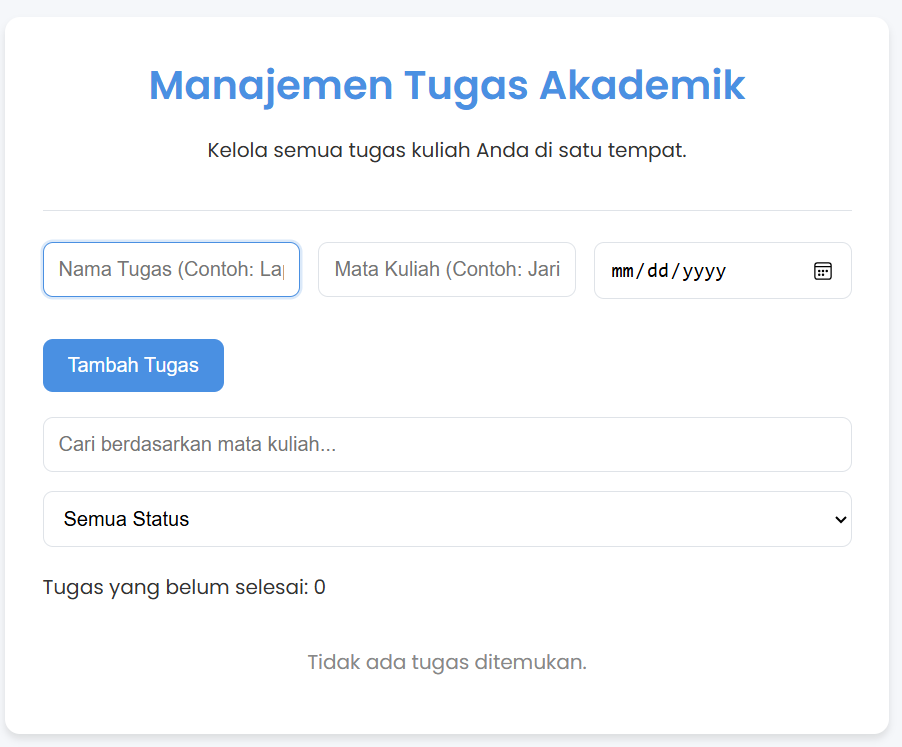
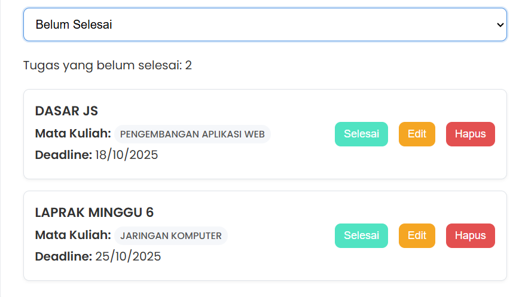
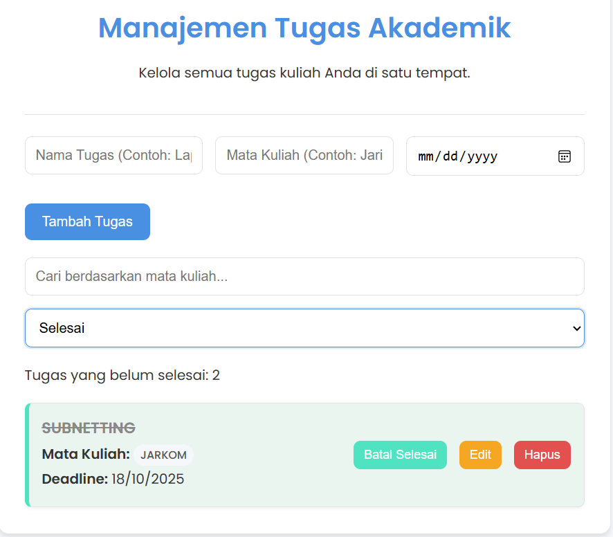

# Aplikasi Manajemen Tugas Mahasiswa

## Penjelasan Singkat
Aplikasi ini membantu mahasiswa mengelola tugas akademik dengan fitur interaktif seperti menambahkan, mengedit, menandai selesai, menghapus tugas, serta filter dan pencarian. Data disimpan secara lokal menggunakan localStorage untuk menjaga privasi dan kemudahan akses.

## Fitur yang Diimplementasikan
- **Menambahkan Tugas**: Tambahkan tugas baru dengan nama, mata kuliah, dan deadline.
- **Menandai Tugas sebagai Selesai/Belum Selesai**: Gunakan checkbox untuk mengubah status.
- **Mengedit Tugas**: Klik tombol "Edit" untuk mengubah detail tugas.
- **Menghapus Tugas**: Klik tombol "Hapus" untuk menghapus tugas.
- **Filter atau Pencarian Tugas**: Cari berdasarkan mata kuliah dan filter berdasarkan status (semua, selesai, belum selesai).
- **Menampilkan Jumlah Tugas Belum Selesai**: Tampilkan hitungan tugas pending di halaman.
- **Validasi Form**: Pastikan nama tugas, mata kuliah, dan deadline tidak kosong serta deadline adalah tanggal valid.

## Cara Menjalankan Aplikasi
1. Unduh semua file (index.html, styles.css, script.js) ke satu folder.
2. Buka file `index.html` di browser web modern (seperti Chrome atau Firefox).
3. Aplikasi akan memuat data dari localStorage jika ada. Uji fitur-fitur seperti menambahkan tugas dan filter.

## Screenshot Aplikasi
Berikut adalah screenshot minimal 3 yang menunjukkan fitur utama (catatan: screenshot ini bersifat deskriptif; gantilah dengan yang sebenarnya saat Anda menjalankan aplikasi).

1. **Halaman Utama dengan Form Tambah Tugas**  
   
   *Deskripsi: Menunjukkan form input dan tombol submit.*

2. **Daftar Tugas dengan Filter**  
  
   *Deskripsi: Menampilkan tugas yang difilter berdasarkan status "Belum Selesai".*

3. **Tugas yang Telah Diselesaikan**  
    
   *Deskripsi: Menunjukkan fungsi mark as done dan statistik tugas.*

## Penjelasan Teknis
- **Penggunaan LocalStorage**: Aplikasi menggunakan `localStorage.setItem('tasks', JSON.stringify(tasks))` untuk menyimpan array tugas setiap kali ada perubahan (misalnya, tambah, edit, hapus). Data dimuat dengan `JSON.parse(localStorage.getItem('tasks'))` saat halaman dibuka, memastikan data persisten. Ini menangani penyimpanan lokal dengan aman dan efisien.
- **Validasi Form**: Implementasi validasi dilakukan di JavaScript saat form disubmit. Misalnya, memeriksa jika `taskName` tidak kosong menggunakan `trim()` dan `if (!taskName)`, serta memvalidasi `deadline` dengan `isNaN(new Date(deadline).getTime())` untuk memastikan format tanggal benar. Pesan error ditampilkan di elemen `
` untuk feedback pengguna.

## 👨‍💻 Author
**RIYAN SANDI PRYAOGA**  
NIM: 123140176  
Mata Kuliah: Pengembangan Aplikasi Web
